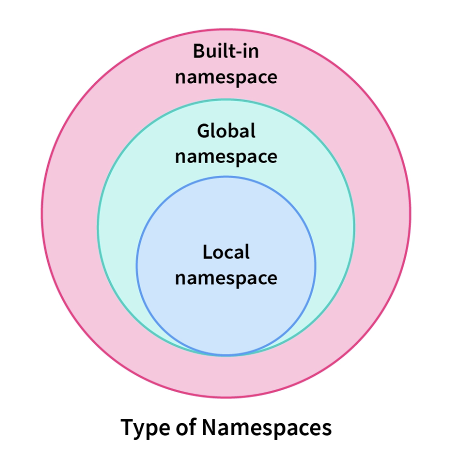

[https://www.markdownguide.org/]: #

# Decorator

Decorators are a powerful and flexible feature in Python that allows the modification of
functions or methods at the time of their definition. They provide a ***way to wrap or modify the
behavior of functions without changing their source code***. Decorators are widely used for
various purposes, such as logging, access control, memoization, and more.

## Why Use Decorators?

1. **Code Reusability**: Decorators allow you to encapsulate reusable functionality
and apply it to multiple functions or methods.
2. **Separation of Concerns**: Decorators help separate the core logic of a function
from additional concerns or behaviors. This promotes a cleaner and more
maintainable codebase.
3. **Readability**: Decorators can enhance the readability of code by keeping the main
logic of a function uncluttered with additional functionalities.
4. **Code Organization**: Decorators enable the organization of cross-cutting
concerns in a modular way, making it easier to manage and maintain the code.
5. **Meta-Programming**: Decorators enable meta-programming by modifying the
behavior of functions dynamically


## Example:
Let's consider a scenario where you have multiple functions that require input validation. Without using a decorator, you would need to write the validation code in each function separately:
<details>

<summary><strong><i><code>code without using decorator approach</code></i></strong></summary>

```python
def process_data(data):
    #To validate the data type
    if isinstance(data, dict) and "value" in data:
        return data["value"] * 2
    else:
        raise ValueError("Invalid data format")

def calculate_average(data):
    #To validate the data type
    if isinstance(data, dict) and "value" in data:
        return (data["value"]) / len(data.keys())
    else:
        raise ValueError("Invalid data format")
```
```python
#positive scenario
valid_data = {"value": 10}
print(process_data(valid_data))
print(calculate_average(valid_data))
```
> **Output for positive scenario**: 
```
 20
 10.0
```

```python
#negative scenario
invalid_data = [1, 2, 3]
print(process_data(invalid_data))
```
> **Output for negative scenario**: 
```
Traceback (most recent call last):
  File "<stdin>", line 1, in <module>
  File "<stdin>", line 5, in process_data
ValueError: Invalid data format
```

*In this case, the validation code is repeated in both `process_data()` and `calculate_average()` functions. This can lead to code duplication and make the code harder to maintain.*
</details>

<details>
<summary><strong><i><code>code with using decorator approach</code></i></strong></summary>

```python
#common func to validate the data type
def validate_data_decorator(func):
    def wrapper(*args, **kwargs):
        data = args[0]
        # common functionality in both *process_data(data)* and *calculate_average(data)*
        if isinstance(data, dict) and "value" in data:
            return func(*args, **kwargs)
        else:
            raise ValueError("Invalid data format")
    return wrapper

@validate_data_decorator
def process_data(data):
    return data["value"] * 2

@validate_data_decorator
def calculate_average(data):
    return (data["value"]) / len(data.keys())
```
```python
#positive scenario
valid_data = {"value": 10}
print(process_data(valid_data))
print(calculate_average(valid_data))
```
> **Output for positive scenario**: 
```
 20
 10.0
```

```python
#negative scenario
invalid_data = [1, 2, 3]
print(process_data(invalid_data))
```
> **Output for negative scenario:** 
```
Traceback (most recent call last):
  File "<stdin>", line 1, in <module>
  File "<stdin>", line 5, in process_data
ValueError: Invalid data format
```
</details>

By comparing the two approaches, the decorator approach provides several benefits. It *reduces code duplication*, *enhances code reusability*, *separates concerns*, *improves code readability*, and *allows for easy modification of the additional functionality applied to multiple functions*.

## Prerequisites for Decorators

- [Namespace and Scope of the variable][ns]
- [LEGB Rule][LEGB] [][LEGB IMG]
- [Closure] [Closure]
    

[ns]:https://www.scaler.com/topics/namespace-and-scope-in-python/ "SCALER Documentation for Namespace and scope of variable"

[LEGB]: https://www.geeksforgeeks.org/scope-resolution-in-python-legb-rule/ "geeksforgeeks documentation for LEGB Rule"

[LEGB IMG]: https://github.com/sabaridass45/scaler/blob/dev/python/Decorators/Type_of_Namespace.png "LEGB image"

[Closure]: https://www.programiz.com/python-programming/closure "Python Closure(Nested Function)"


  


